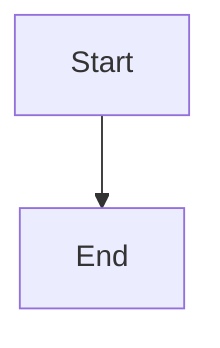
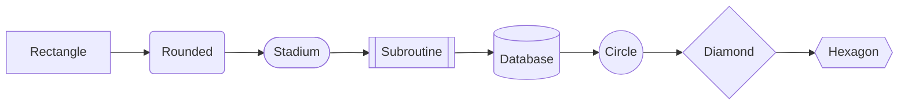
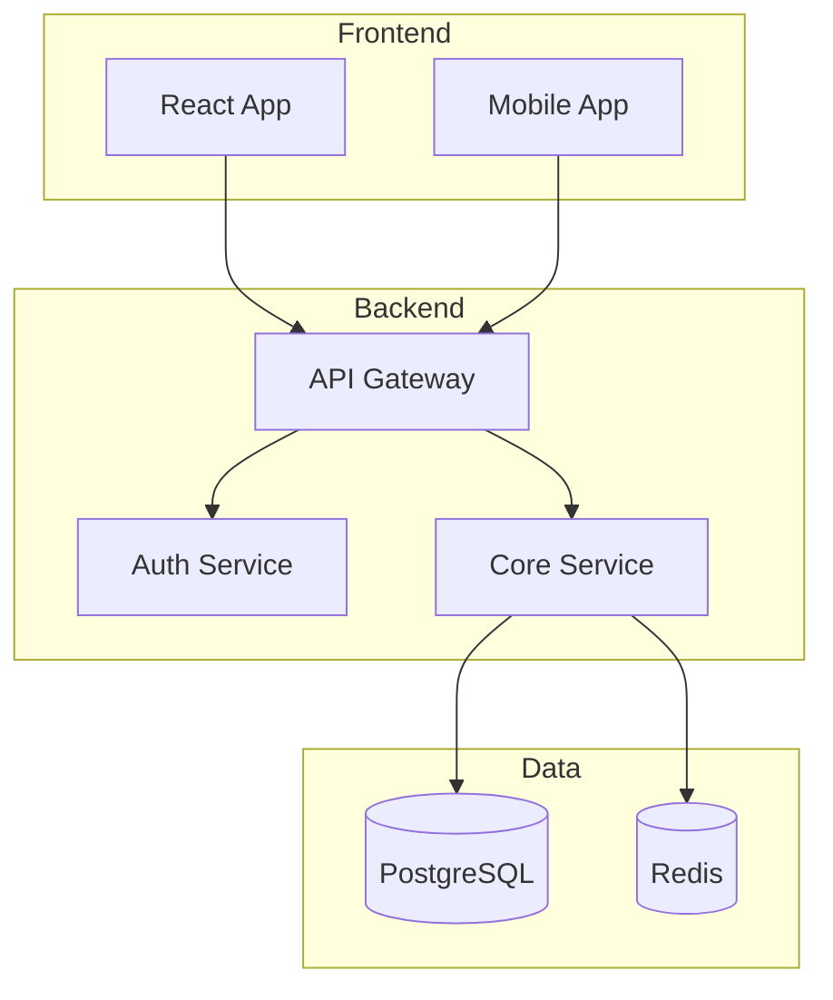
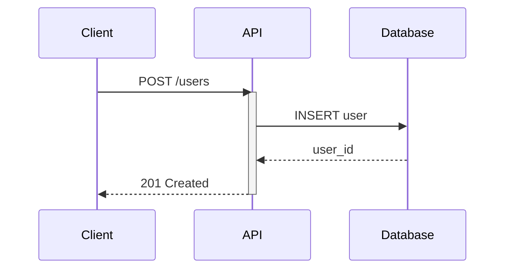
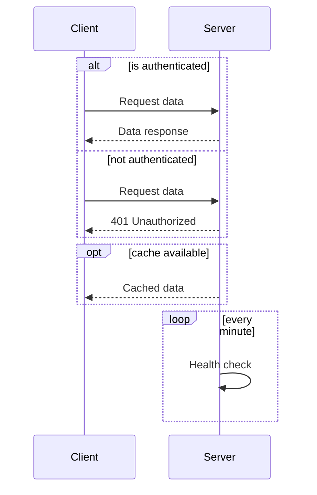
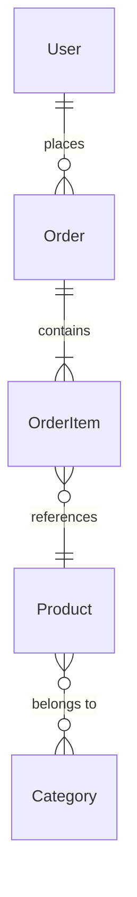
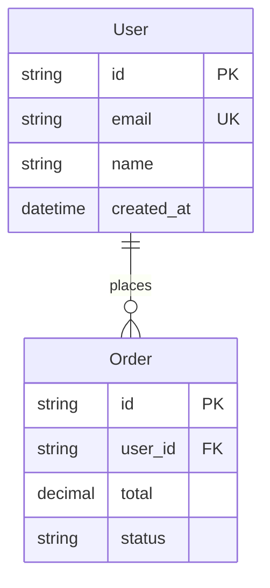
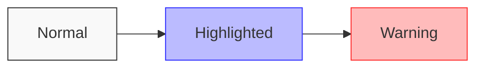
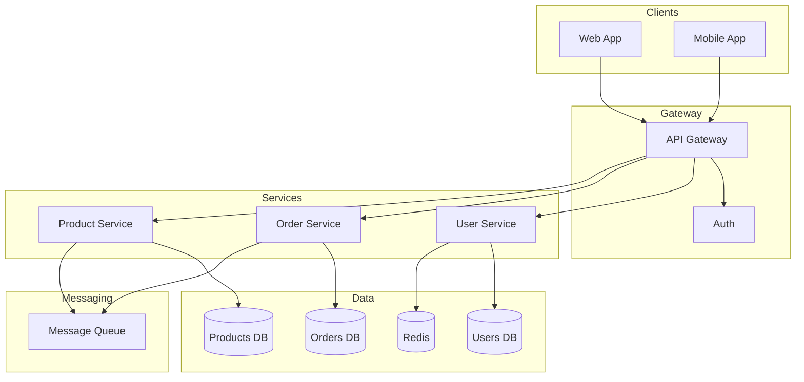
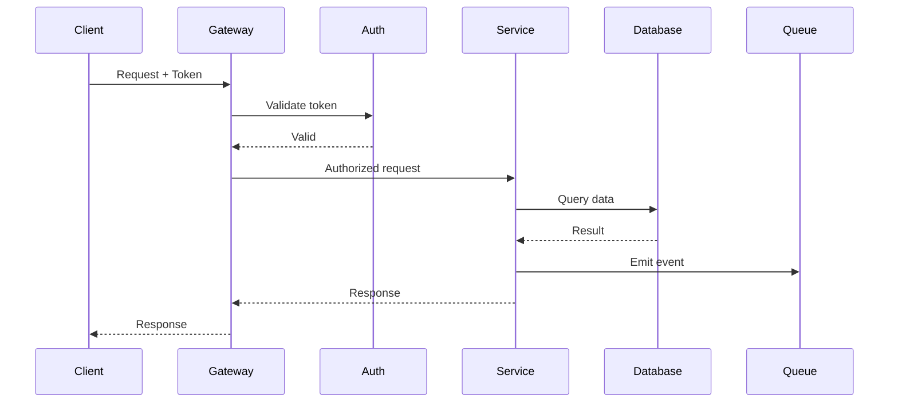

# Mermaid Diagramming

## Quick Reference

| Diagram Type | Use Case | Reference |
|--------------|----------|-----------|
| Flowchart | System architecture, data flow, decision trees | See [flowcharts.md](references/flowcharts.md) |
| Sequence | API interactions, request flows, protocols | See [sequence.md](references/sequence.md) |
| Entity Relationship | Database schemas, data models | See [entity-relationship.md](references/entity-relationship.md) |
| Class | Object models, domain models, interfaces | See [class-diagrams.md](references/class-diagrams.md) |
| State | State machines, workflows, lifecycles | See [state-diagrams.md](references/state-diagrams.md) |

## Core Syntax

All Mermaid diagrams start with a diagram type declaration:



### Diagram Types

| Declaration | Type |
|-------------|------|
| `graph TD` / `graph LR` | Flowchart (top-down / left-right) |
| `sequenceDiagram` | Sequence diagram |
| `erDiagram` | Entity-relationship |
| `classDiagram` | Class diagram |
| `stateDiagram-v2` | State diagram |
| `flowchart TD` | Enhanced flowchart |

## Flowchart Essentials

### Direction
- `TD` / `TB` - Top to bottom
- `LR` - Left to right
- `RL` - Right to left
- `BT` - Bottom to top

### Node Shapes


### Connections
```
A --> B       Solid arrow
A --- B       Solid line
A -.-> B      Dotted arrow
A -.- B       Dotted line
A ==> B       Thick arrow
A === B       Thick line
A --text--> B Labeled arrow
```

### Subgraphs


## Sequence Diagram Essentials



### Message Types
```
->>   Solid arrow (sync request)
-->>  Dashed arrow (response)
-)    Open arrow (async)
--)   Dashed open arrow (async response)
-x    Cross (failed)
--x   Dashed cross (failed response)
```

### Control Flow


## Entity Relationship Essentials



### Relationship Types
```
||--||   One to one
||--o{   One to many
}o--o{   Many to many
||--|{   One to one or more
}o--||   Many to one
```

### Attributes


## Best Practices

### Clarity
- Keep diagrams focused on one concept
- Use meaningful node labels
- Group related items in subgraphs
- Use consistent naming conventions

### Layout
- Choose direction based on reading flow (LR for processes, TD for hierarchies)
- Use subgraphs to organize complex diagrams
- Limit crossing lines where possible

### Styling


## Common Patterns

### Microservices Architecture


### Request Flow


For detailed syntax and advanced patterns, see the reference files.
