# Mermaid Flowcharts

## Table of Contents
- [Basic Syntax](#basic-syntax)
- [Node Shapes](#node-shapes)
- [Links and Arrows](#links-and-arrows)
- [Subgraphs](#subgraphs)
- [Styling](#styling)
- [Architecture Patterns](#architecture-patterns)

## Basic Syntax

### Direction

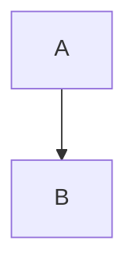

| Direction | Meaning |
|-----------|---------|
| `TD` / `TB` | Top to Down / Top to Bottom |
| `BT` | Bottom to Top |
| `LR` | Left to Right |
| `RL` | Right to Left |

### Node Declaration

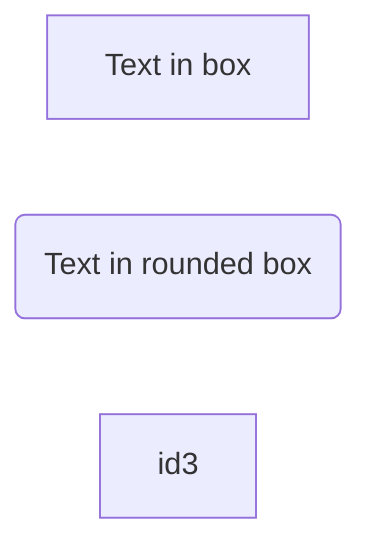

Nodes without text use their ID as the label.

## Node Shapes

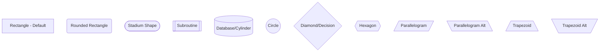

### When to Use Each Shape

| Shape | Use Case |
|-------|----------|
| Rectangle `[text]` | Process, action, service |
| Rounded `(text)` | Start/end, user action |
| Stadium `([text])` | Terminal, entry point |
| Subroutine `[[text]]` | Predefined process, external call |
| Database `[(text)]` | Data store, database, cache |
| Circle `((text))` | Connector, junction |
| Diamond `{text}` | Decision, condition |
| Hexagon `{{text}}` | Preparation, setup |

## Links and Arrows

### Arrow Types

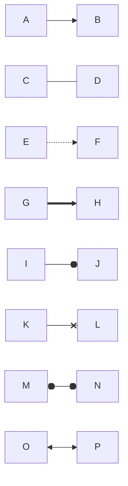

| Syntax | Description |
|--------|-------------|
| `-->` | Arrow |
| `---` | Line without arrow |
| `-.->` | Dotted arrow |
| `-.-` | Dotted line |
| `==>` | Thick arrow |
| `===` | Thick line |
| `--o` | Circle end |
| `--x` | Cross end |
| `o--o` | Circle both ends |
| `<-->` | Arrow both ends |

### Labels on Links

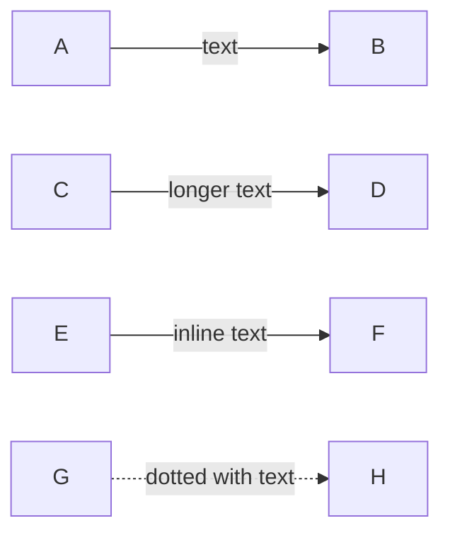

### Link Length

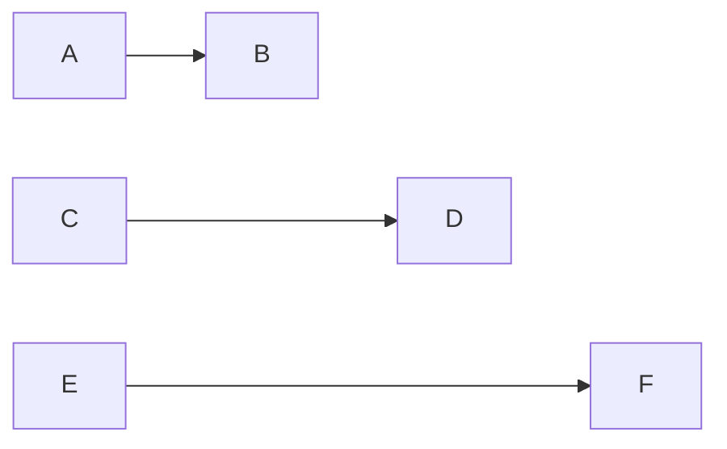

More dashes = longer link (works for all arrow types).

## Subgraphs

### Basic Subgraph

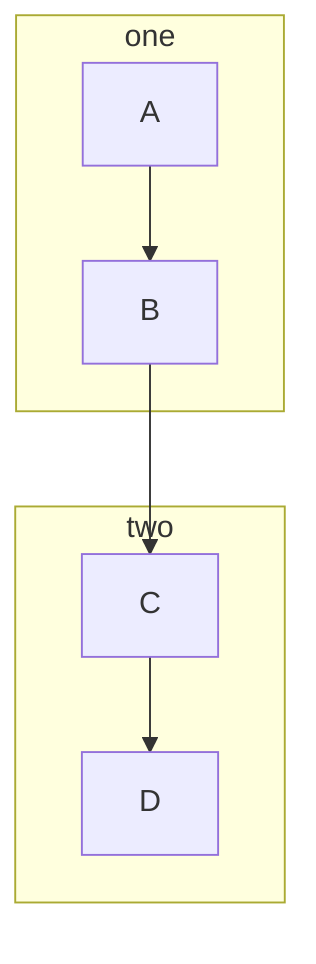

### Nested Subgraphs

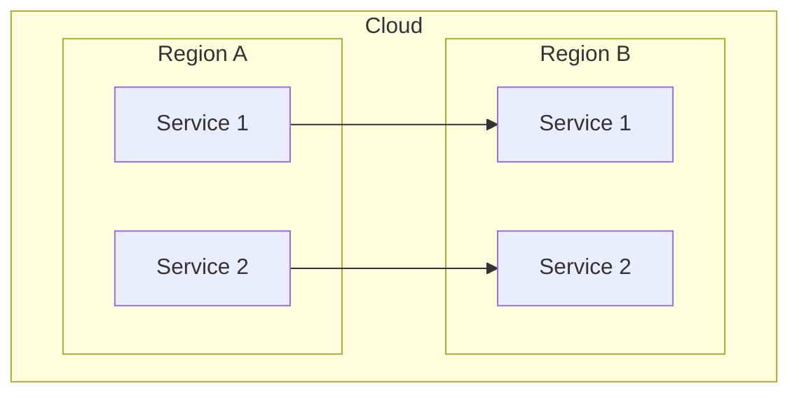

### Subgraph Direction

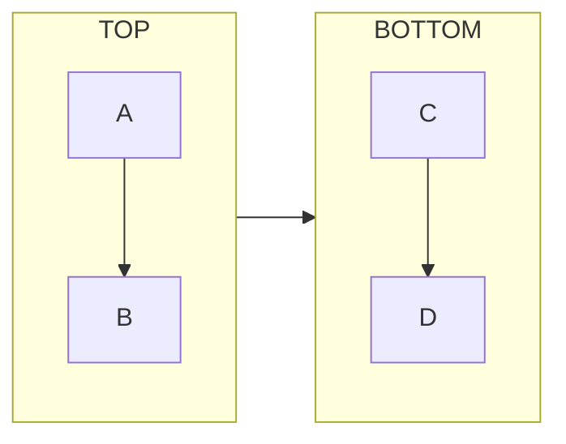

## Styling

### Inline Styles

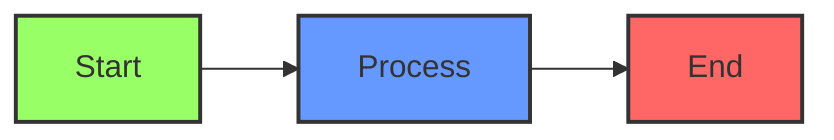

### Style Definitions

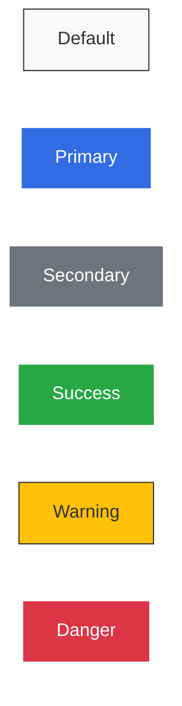

### Link Styles

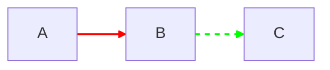

## Architecture Patterns

### Three-Tier Architecture

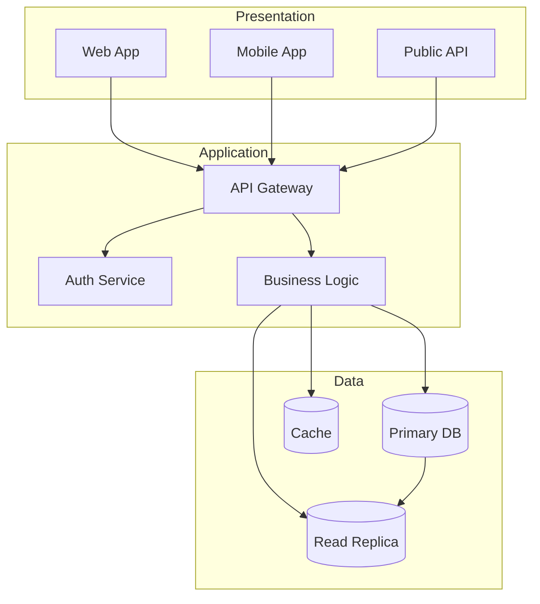

### Event-Driven Architecture

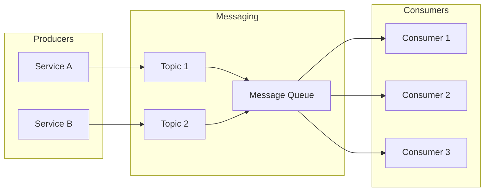

### CI/CD Pipeline

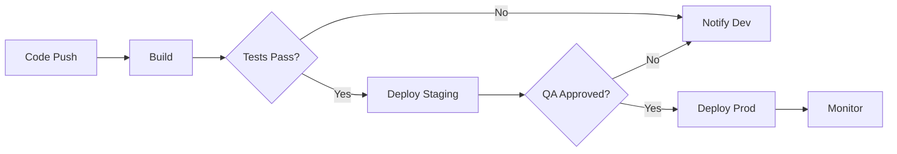

### Decision Flow

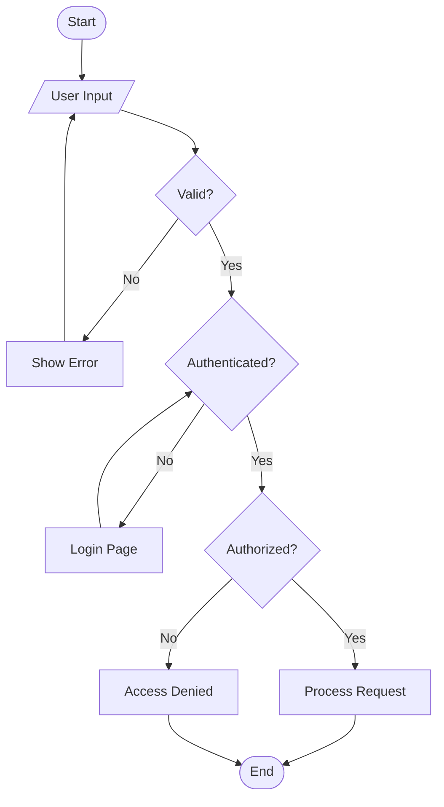
