# Mermaid Class Diagrams

## Table of Contents
- [Basic Syntax](#basic-syntax)
- [Class Members](#class-members)
- [Relationships](#relationships)
- [Annotations](#annotations)
- [Common Patterns](#common-patterns)

## Basic Syntax

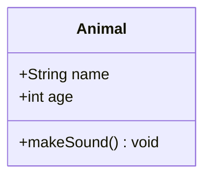

## Class Members

### Visibility

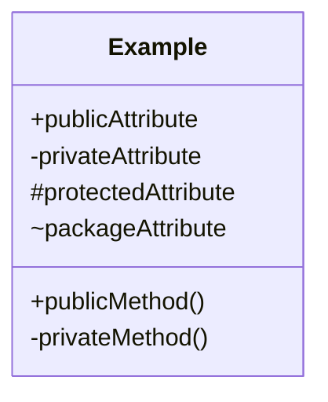

| Symbol | Visibility |
|--------|------------|
| `+` | Public |
| `-` | Private |
| `#` | Protected |
| `~` | Package/Internal |

### Methods with Parameters

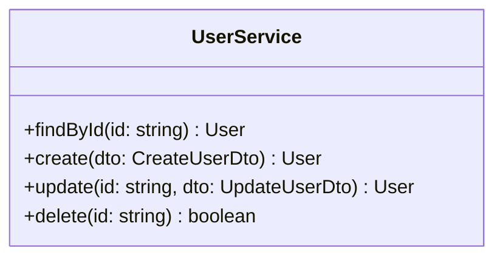

### Static and Abstract

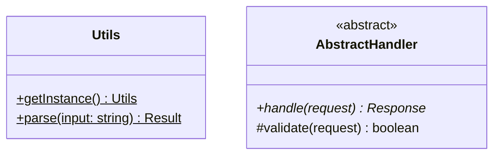

## Relationships

### Relationship Types

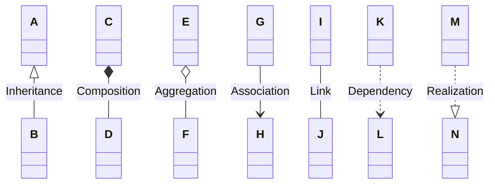

| Syntax | Type | Meaning |
|--------|------|---------|
| `<\|--` | Inheritance | B extends A |
| `*--` | Composition | D is part of C (lifecycle bound) |
| `o--` | Aggregation | F belongs to E (independent lifecycle) |
| `-->` | Association | G uses H |
| `--` | Link | Simple association |
| `..>` | Dependency | I depends on J |
| `..\|>` | Realization | K implements L |

### Cardinality

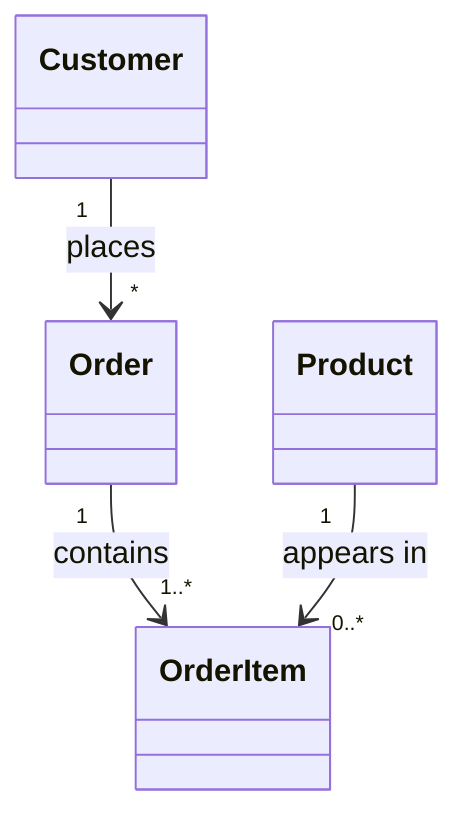

## Annotations

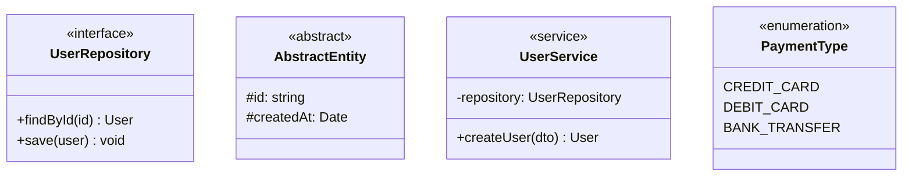

Common annotations:
- `<<interface>>`
- `<<abstract>>`
- `<<service>>`
- `<<enumeration>>`
- `<<entity>>`
- `<<repository>>`

## Common Patterns

### Repository Pattern

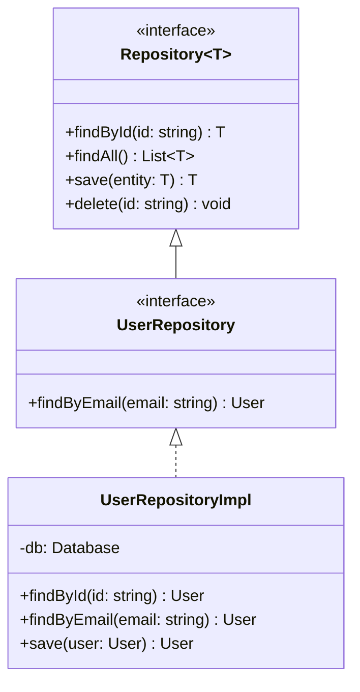

### Domain Model

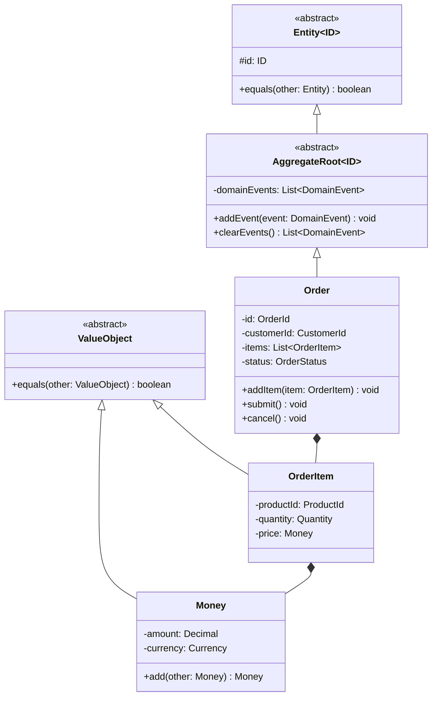

### Service Layer

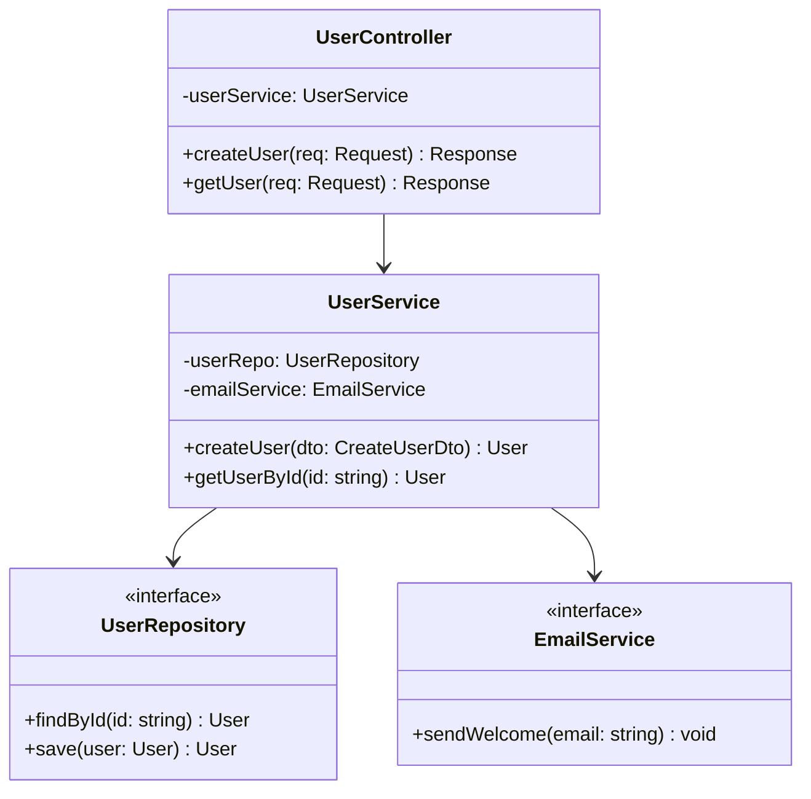

### State Pattern

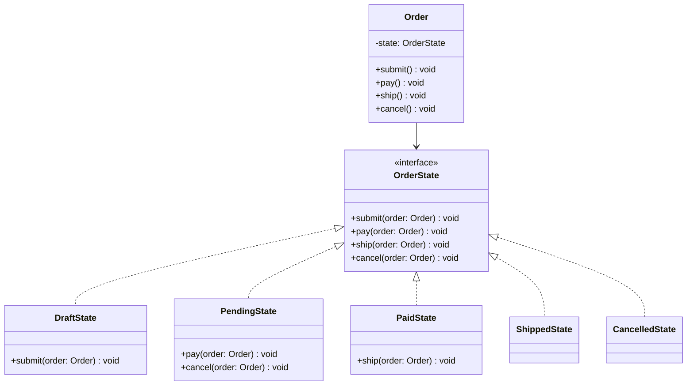
