# Mermaid Entity-Relationship Diagrams

## Table of Contents
- [Basic Syntax](#basic-syntax)
- [Relationships](#relationships)
- [Attributes](#attributes)
- [Keys and Constraints](#keys-and-constraints)
- [Common Patterns](#common-patterns)

## Basic Syntax

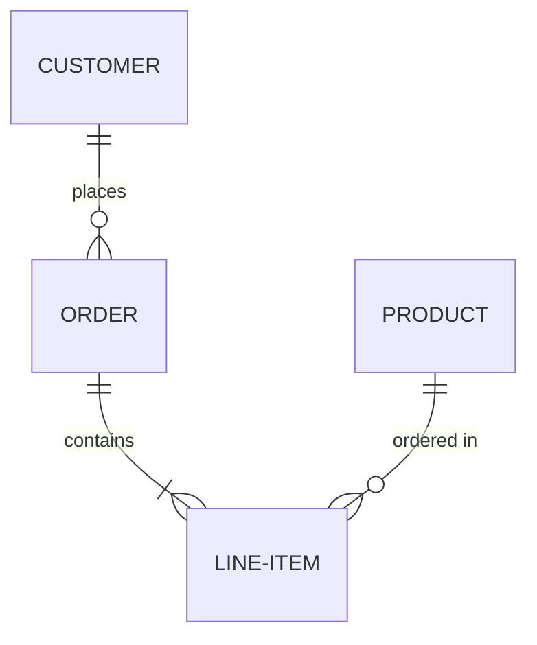

## Relationships

### Cardinality Notation

```
||    Exactly one
|o    Zero or one
}|    One or more
}o    Zero or more
```

### Relationship Types

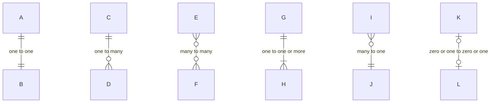

### Relationship Labels

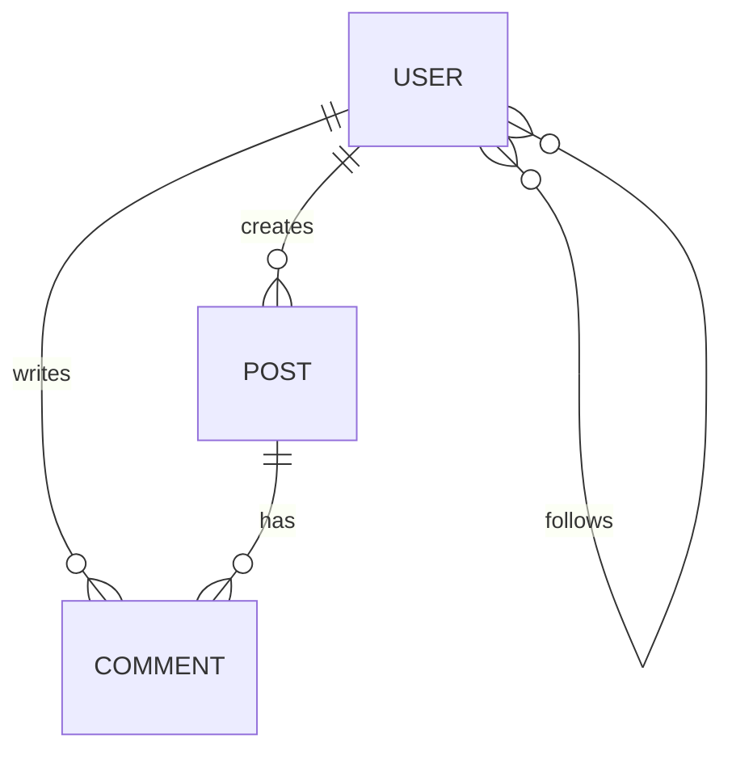

## Attributes

### Basic Attributes

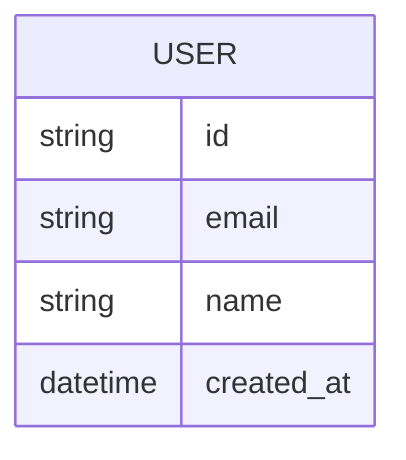

### Data Types

Common attribute types:
- `string` - Text data
- `int` / `integer` - Whole numbers
- `float` / `decimal` - Decimal numbers
- `boolean` / `bool` - True/false
- `datetime` / `timestamp` - Date and time
- `date` - Date only
- `uuid` - UUID identifiers
- `json` / `jsonb` - JSON data
- `text` - Long text
- `blob` - Binary data

### Full Example with Types

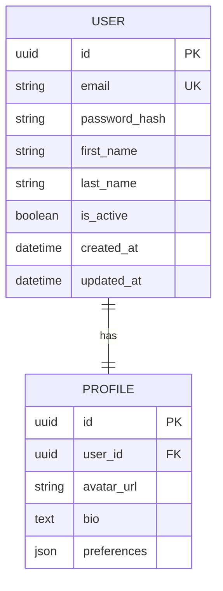

## Keys and Constraints

### Key Types

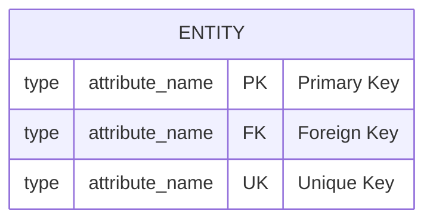

### Composite Keys

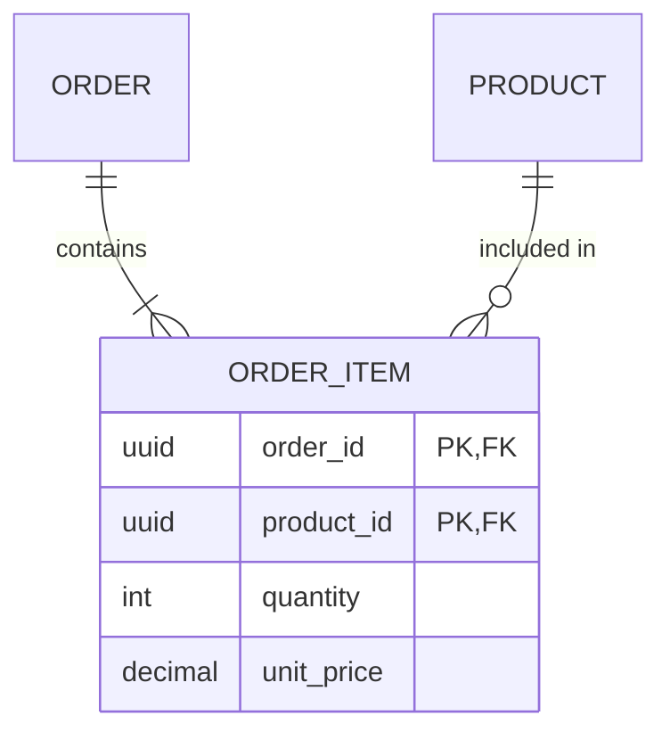

## Common Patterns

### User Authentication System

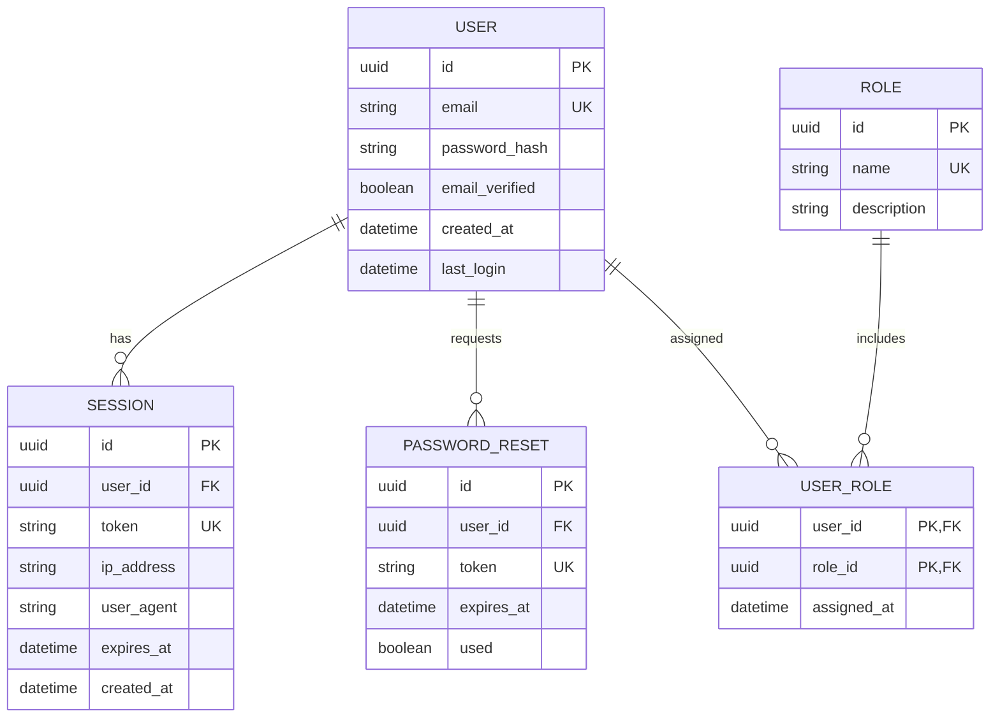

### E-Commerce Domain

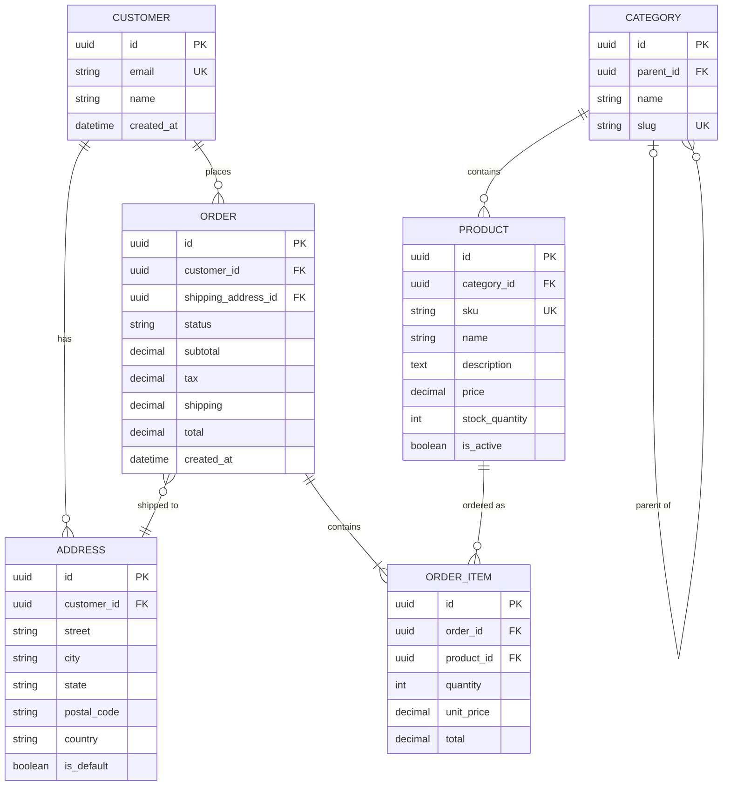

### Content Management System

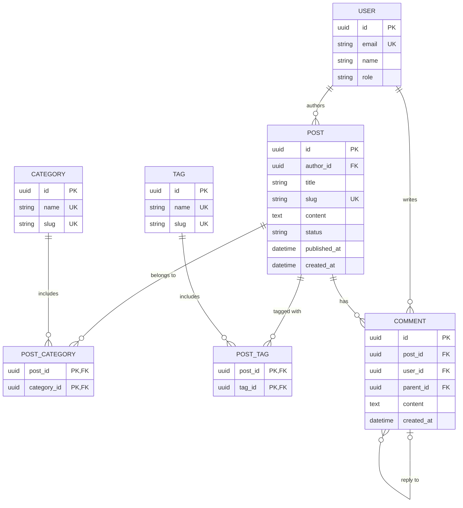

### Multi-Tenant SaaS

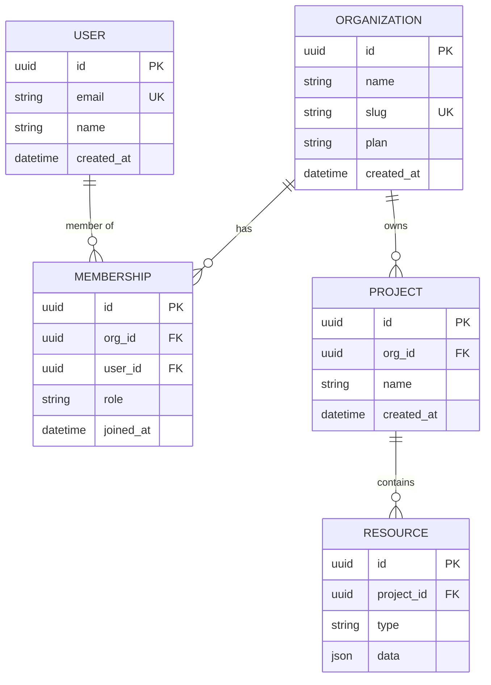

### Audit Trail Pattern

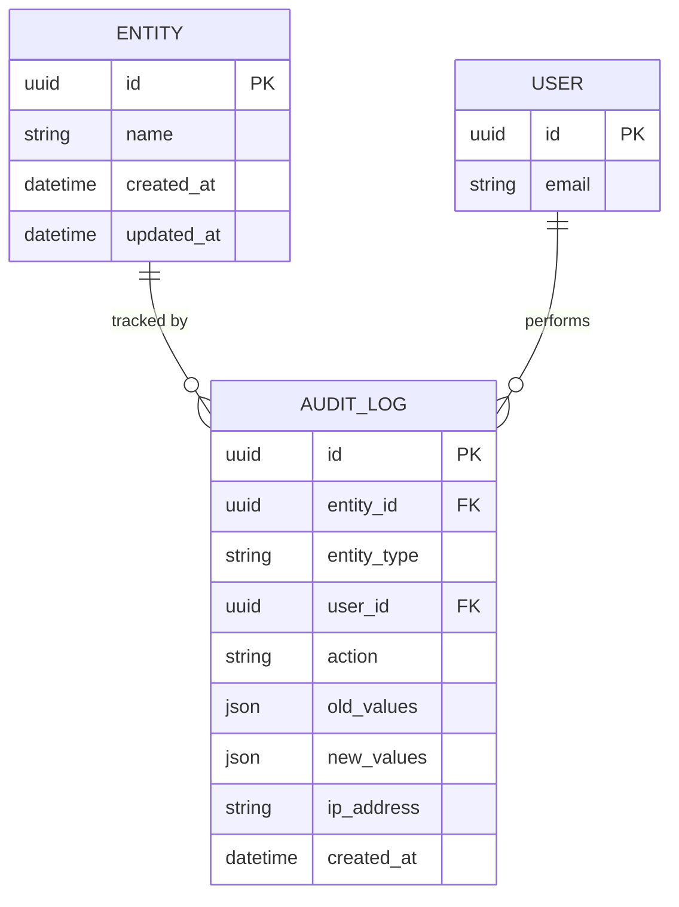
