# Mermaid Sequence Diagrams

## Table of Contents
- [Basic Syntax](#basic-syntax)
- [Participants](#participants)
- [Messages](#messages)
- [Activation](#activation)
- [Control Flow](#control-flow)
- [Notes](#notes)
- [Common Patterns](#common-patterns)

## Basic Syntax

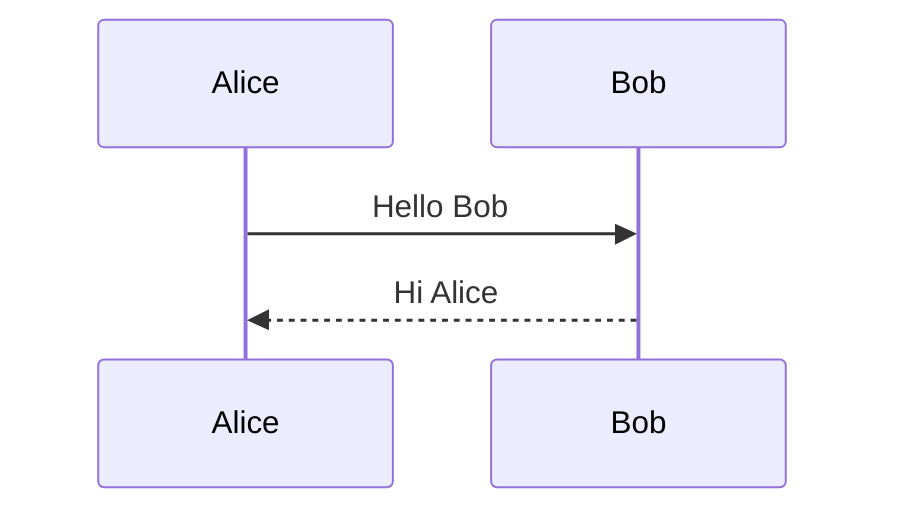
```mermaid
sequenceDiagram
    Alice->>Bob: Hello Bob
    Bob-->>Alice: Hi Alice
```

## Participants

### Declaring Participants

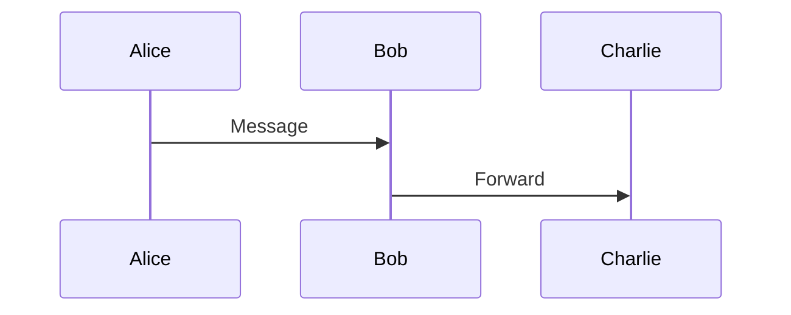
```mermaid
sequenceDiagram
    participant A as Alice
    participant B as Bob
    participant C as Charlie

    A->>B: Message
    B->>C: Forward
```

### Actors (Stick Figures)

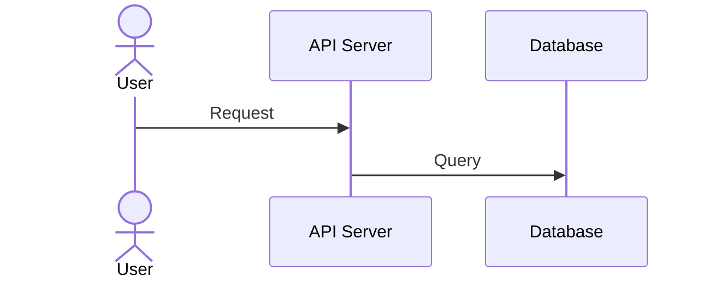
```mermaid
sequenceDiagram
    actor User
    participant API as API Server
    participant DB as Database

    User->>API: Request
    API->>DB: Query
```

### Participant Order

Participants appear in order of declaration, or first appearance if not declared.

## Messages

### Message Types

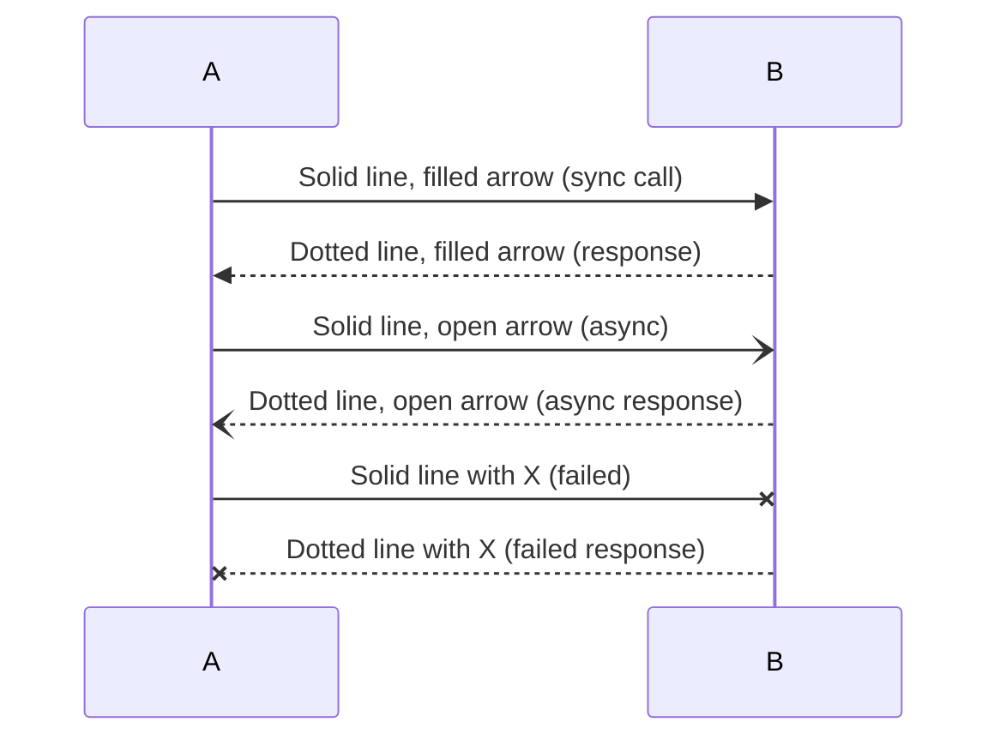
```mermaid
sequenceDiagram
    participant A
    participant B

    A->>B: Solid line, filled arrow (sync call)
    B-->>A: Dotted line, filled arrow (response)
    A-)B: Solid line, open arrow (async)
    B--)A: Dotted line, open arrow (async response)
    A-xB: Solid line with X (failed)
    B--xA: Dotted line with X (failed response)
```

| Syntax | Meaning |
|--------|---------|
| `->>` | Synchronous request |
| `-->>` | Response |
| `-)` | Asynchronous message |
| `--)` | Async response |
| `-x` | Failed/rejected |
| `--x` | Failed response |

### Self-Messages

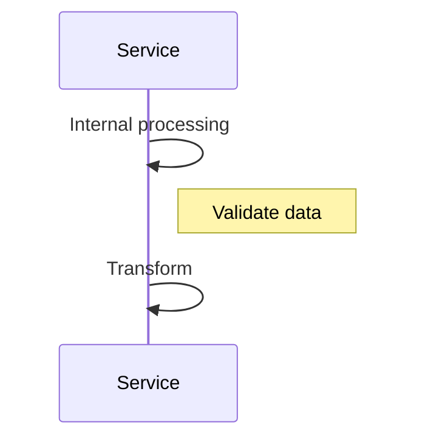
```mermaid
sequenceDiagram
    participant S as Service

    S->>S: Internal processing
    Note right of S: Validate data
    S->>S: Transform
```

## Activation

### Basic Activation

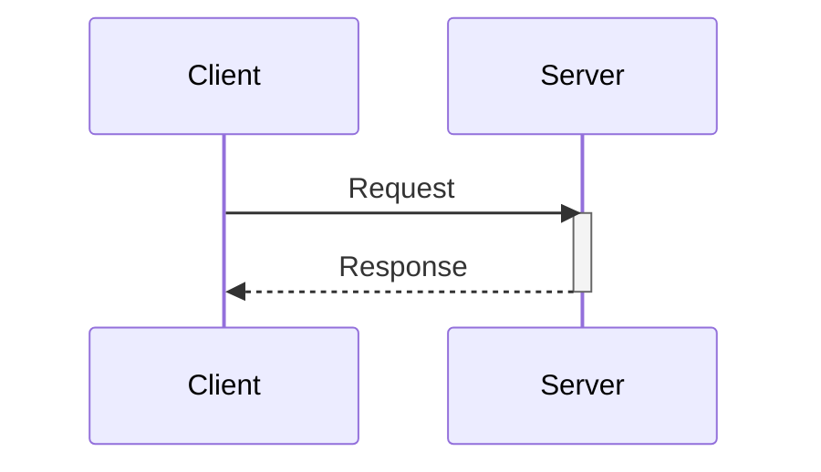
```mermaid
sequenceDiagram
    participant C as Client
    participant S as Server

    C->>S: Request
    activate S
    S-->>C: Response
    deactivate S
```

### Shorthand Activation

```mermaid
sequenceDiagram
    participant C as Client
    participant S as Server

    C->>+S: Request
    S-->>-C: Response
```

### Nested Activation

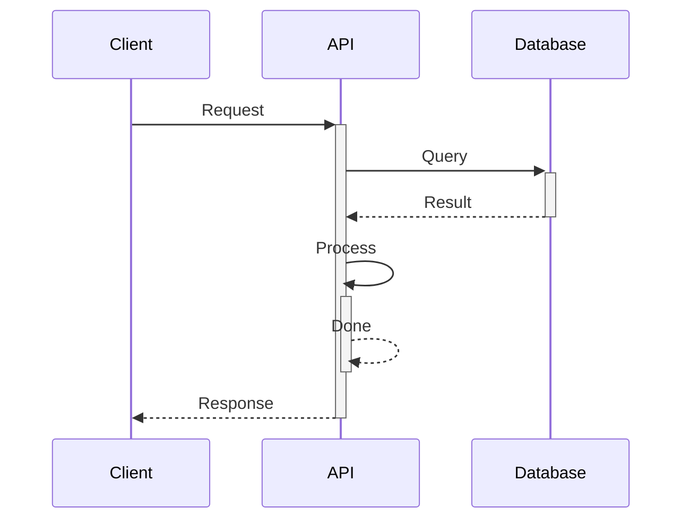
```mermaid
sequenceDiagram
    participant C as Client
    participant A as API
    participant D as Database

    C->>+A: Request
    A->>+D: Query
    D-->>-A: Result
    A->>+A: Process
    A-->>-A: Done
    A-->>-C: Response
```

## Control Flow

### Alt (If-Else)

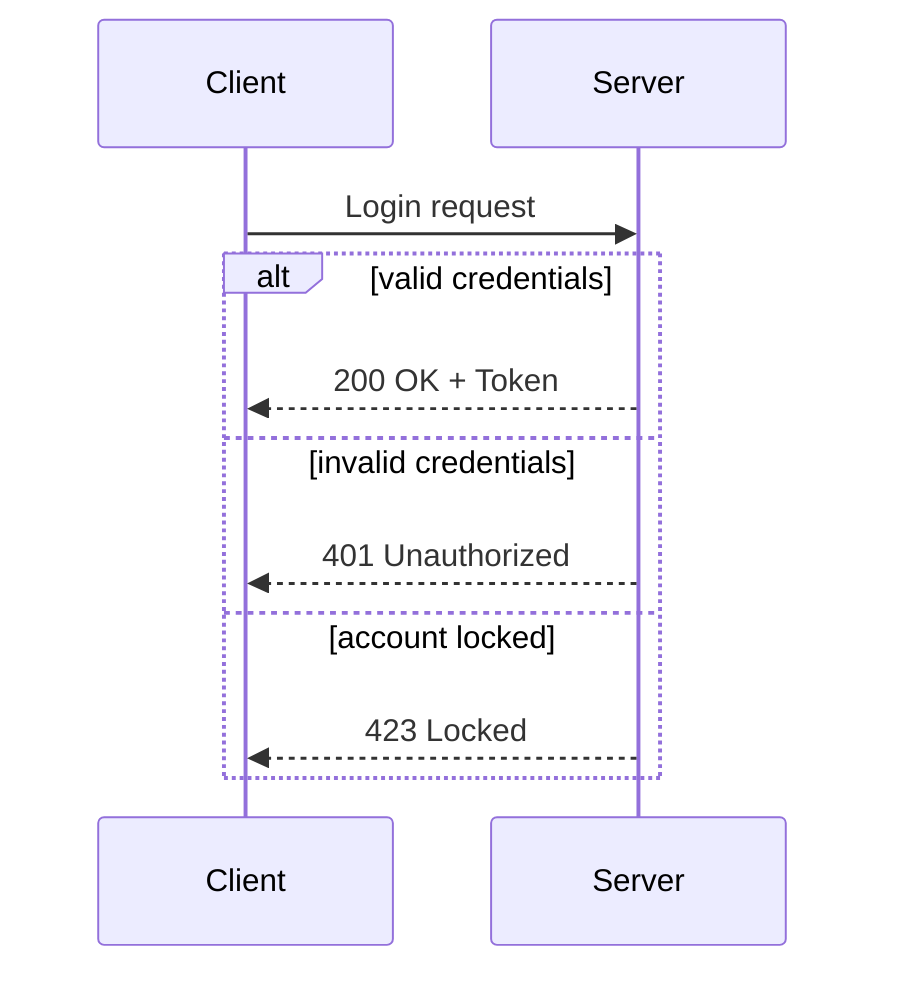
```mermaid
sequenceDiagram
    participant C as Client
    participant S as Server

    C->>S: Login request

    alt valid credentials
        S-->>C: 200 OK + Token
    else invalid credentials
        S-->>C: 401 Unauthorized
    else account locked
        S-->>C: 423 Locked
    end
```

### Opt (Optional)

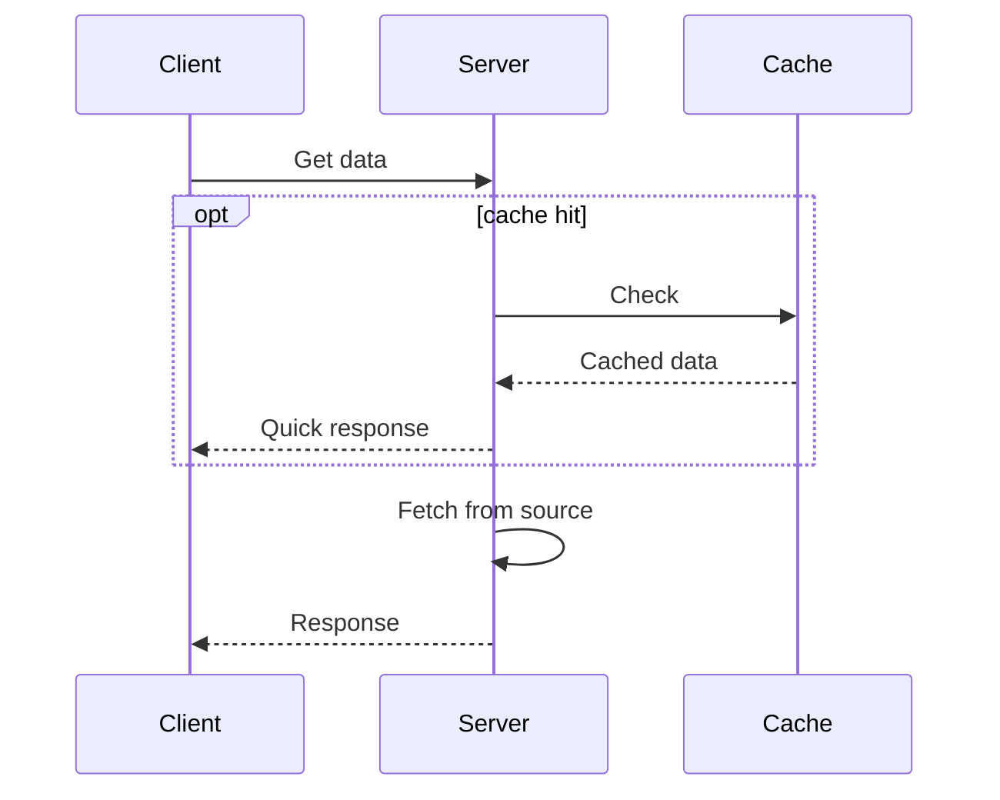
```mermaid
sequenceDiagram
    participant C as Client
    participant S as Server
    participant Cache

    C->>S: Get data

    opt cache hit
        S->>Cache: Check
        Cache-->>S: Cached data
        S-->>C: Quick response
    end

    S->>S: Fetch from source
    S-->>C: Response
```

### Loop

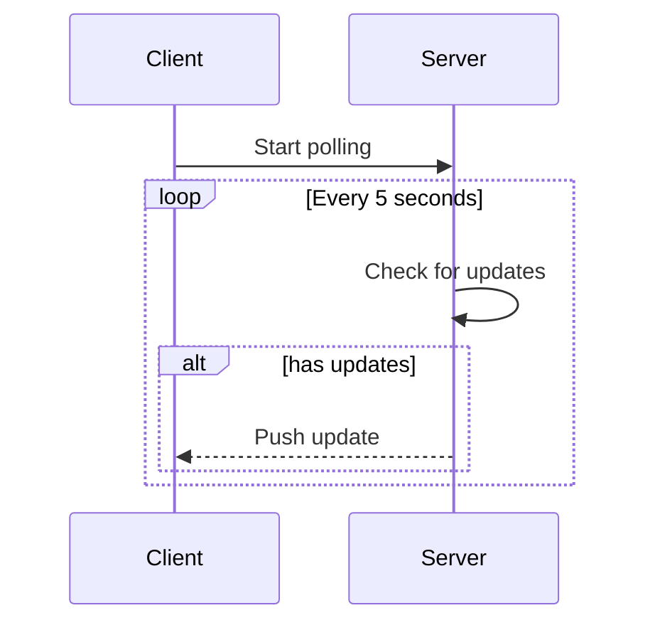
```mermaid
sequenceDiagram
    participant C as Client
    participant S as Server

    C->>S: Start polling

    loop Every 5 seconds
        S->>S: Check for updates
        alt has updates
            S-->>C: Push update
        end
    end
```

### Par (Parallel)

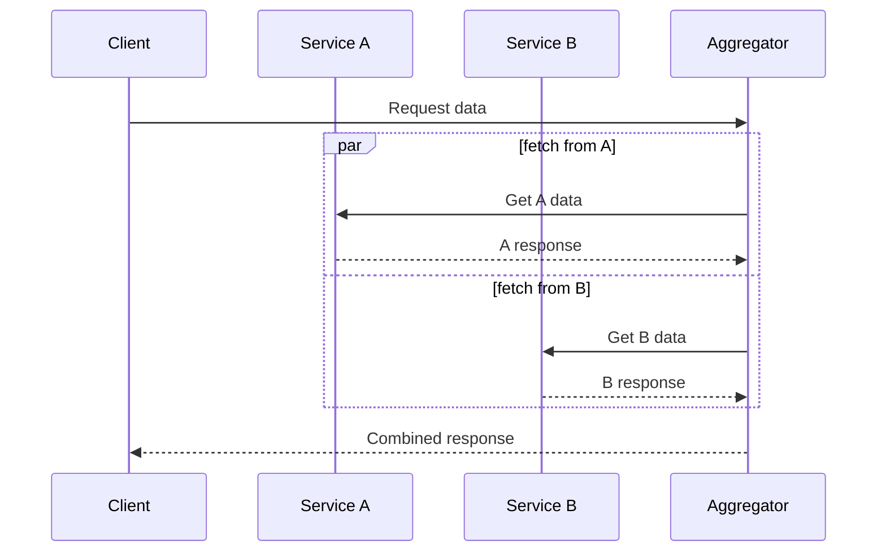
```mermaid
sequenceDiagram
    participant C as Client
    participant A as Service A
    participant B as Service B
    participant D as Aggregator

    C->>D: Request data

    par fetch from A
        D->>A: Get A data
        A-->>D: A response
    and fetch from B
        D->>B: Get B data
        B-->>D: B response
    end

    D-->>C: Combined response
```

### Critical

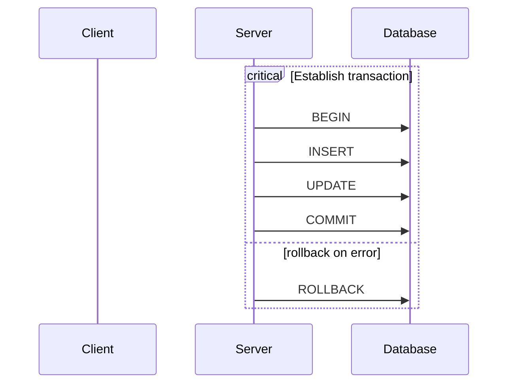
```mermaid
sequenceDiagram
    participant C as Client
    participant S as Server
    participant DB as Database

    critical Establish transaction
        S->>DB: BEGIN
        S->>DB: INSERT
        S->>DB: UPDATE
        S->>DB: COMMIT
    option rollback on error
        S->>DB: ROLLBACK
    end
```

### Break

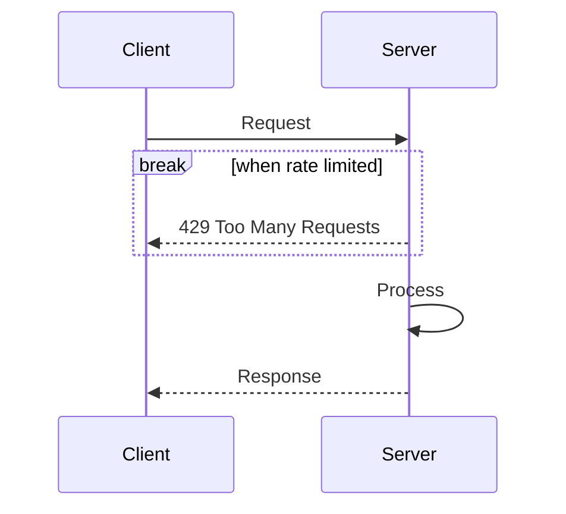
```mermaid
sequenceDiagram
    participant C as Client
    participant S as Server

    C->>S: Request

    break when rate limited
        S-->>C: 429 Too Many Requests
    end

    S->>S: Process
    S-->>C: Response
```

## Notes

### Note Positions

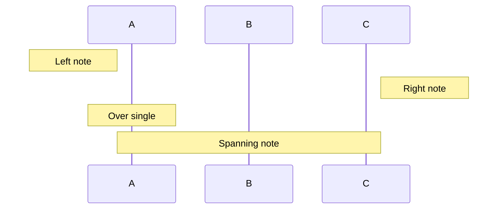
```mermaid
sequenceDiagram
    participant A
    participant B
    participant C

    Note left of A: Left note
    Note right of C: Right note
    Note over A: Over single
    Note over A,C: Spanning note
```

### Notes in Flow

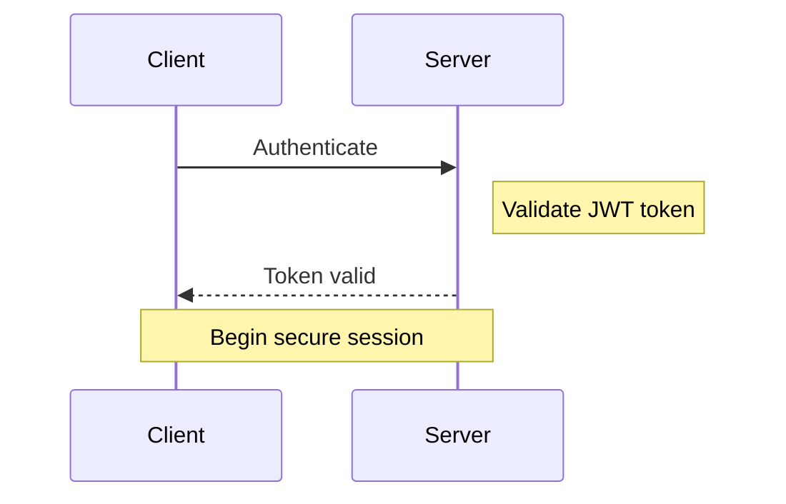
```mermaid
sequenceDiagram
    participant C as Client
    participant S as Server

    C->>S: Authenticate
    Note right of S: Validate JWT token
    S-->>C: Token valid

    Note over C,S: Begin secure session
```

## Common Patterns

### REST API Call

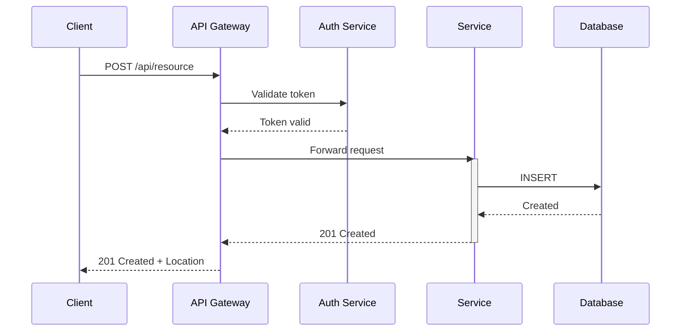
```mermaid
sequenceDiagram
    participant C as Client
    participant G as API Gateway
    participant A as Auth Service
    participant S as Service
    participant D as Database

    C->>G: POST /api/resource
    G->>A: Validate token
    A-->>G: Token valid

    G->>S: Forward request
    activate S
    S->>D: INSERT
    D-->>S: Created
    S-->>G: 201 Created
    deactivate S

    G-->>C: 201 Created + Location
```

### OAuth2 Flow

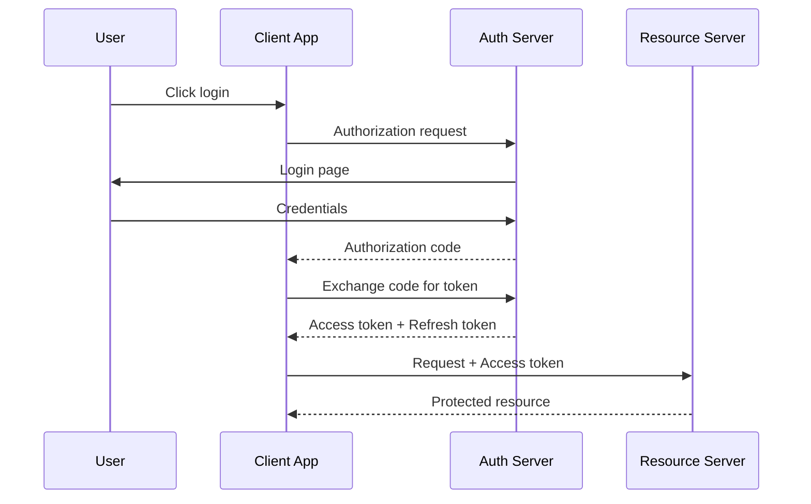
```mermaid
sequenceDiagram
    participant U as User
    participant C as Client App
    participant A as Auth Server
    participant R as Resource Server

    U->>C: Click login
    C->>A: Authorization request
    A->>U: Login page
    U->>A: Credentials
    A-->>C: Authorization code

    C->>A: Exchange code for token
    A-->>C: Access token + Refresh token

    C->>R: Request + Access token
    R-->>C: Protected resource
```

### Retry Pattern

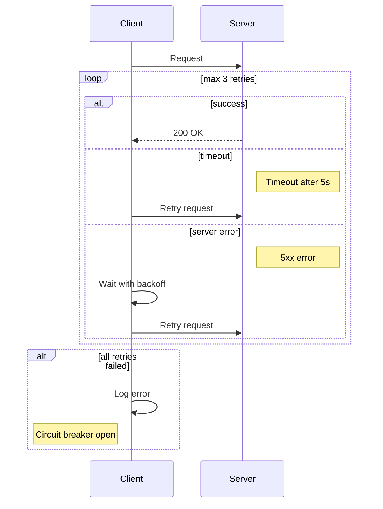
```mermaid
sequenceDiagram
    participant C as Client
    participant S as Server

    C->>S: Request

    loop max 3 retries
        alt success
            S-->>C: 200 OK
        else timeout
            Note right of S: Timeout after 5s
            C->>S: Retry request
        else server error
            Note right of S: 5xx error
            C->>C: Wait with backoff
            C->>S: Retry request
        end
    end

    alt all retries failed
        C->>C: Log error
        Note left of C: Circuit breaker open
    end
```

### Pub/Sub Pattern

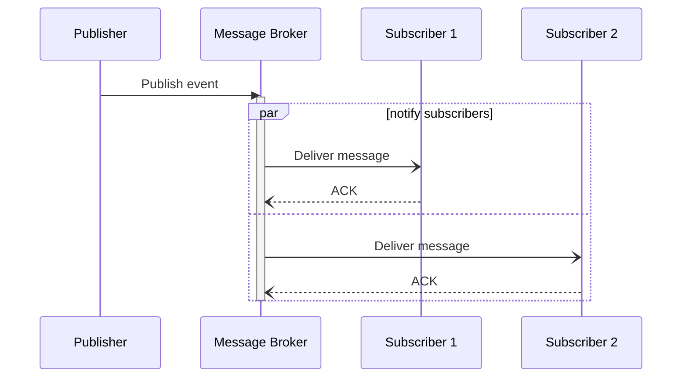
```mermaid
sequenceDiagram
    participant P as Publisher
    participant B as Message Broker
    participant S1 as Subscriber 1
    participant S2 as Subscriber 2

    P->>B: Publish event
    activate B

    par notify subscribers
        B-)S1: Deliver message
        S1--)B: ACK
    and
        B-)S2: Deliver message
        S2--)B: ACK
    end

    deactivate B
```

### Saga Pattern

```mermaid
sequenceDiagram
    participant O as Orchestrator
    participant A as Service A
    participant B as Service B
    participant C as Service C

    O->>A: Step 1
    A-->>O: Success

    O->>B: Step 2
    B-->>O: Success

    O->>C: Step 3
    C--xO: Failed

    Note over O: Compensating transactions
    O->>B: Rollback Step 2
    B-->>O: Rolled back
    O->>A: Rollback Step 1
    A-->>O: Rolled back
```
