# Mermaid State Diagrams

## Table of Contents
- [Basic Syntax](#basic-syntax)
- [States](#states)
- [Transitions](#transitions)
- [Composite States](#composite-states)
- [Common Patterns](#common-patterns)

## Basic Syntax

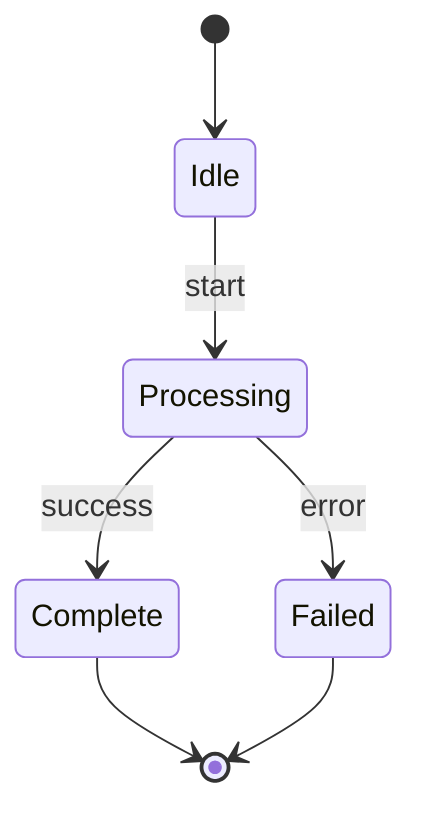

## States

### Simple States

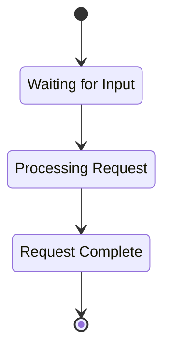

### State Descriptions

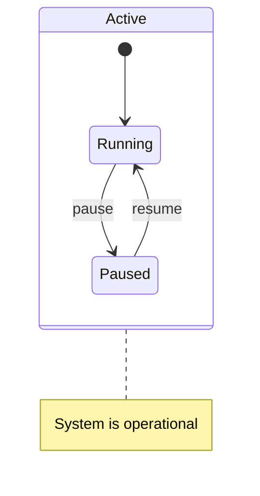

## Transitions

### Labeled Transitions

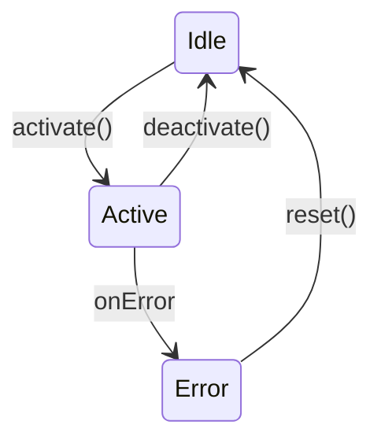

### Conditional Transitions

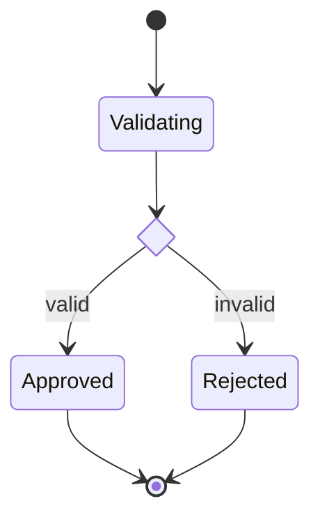

### Fork and Join

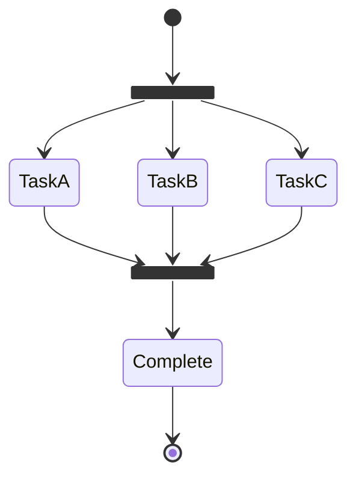

## Composite States

### Nested States

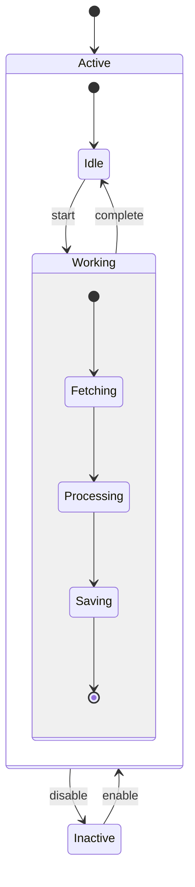

### Concurrent States

```mermaid
stateDiagram-v2
    [*] --> Active

    state Active {
        [*] --> Running

        state Running {
            --
            state "UI Thread" as ui {
                [*] --> Rendering
                Rendering --> Updating
                Updating --> Rendering
            }
            --
            state "Background" as bg {
                [*] --> Polling
                Polling --> Processing
                Processing --> Polling
            }
        }
    }
```

## Common Patterns

### Order Lifecycle

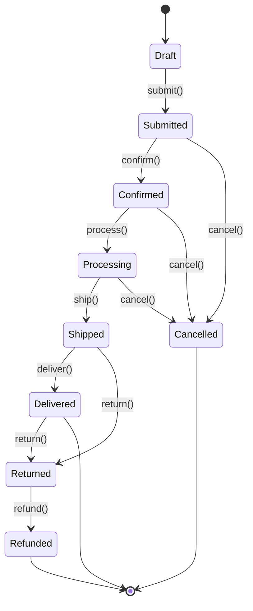

### Authentication Flow

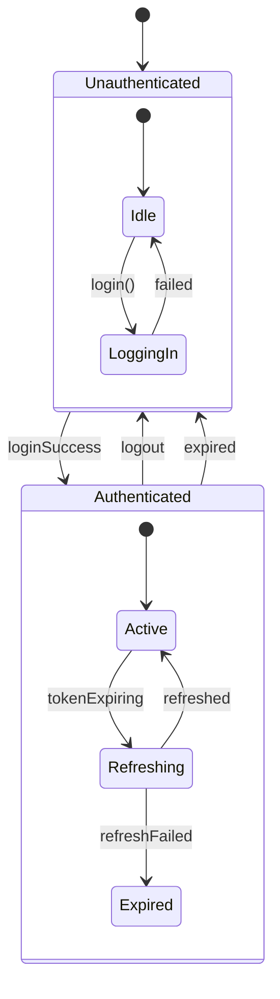

### Request Processing

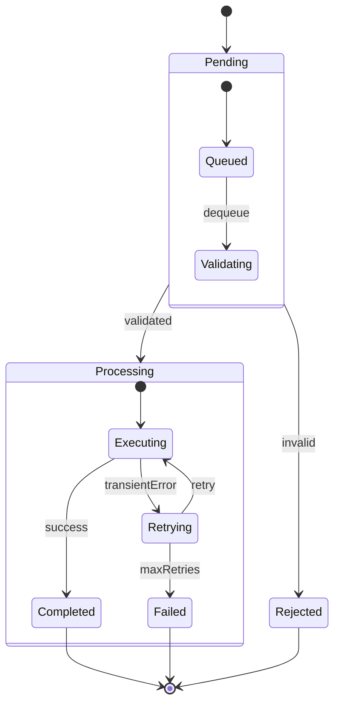

### WebSocket Connection

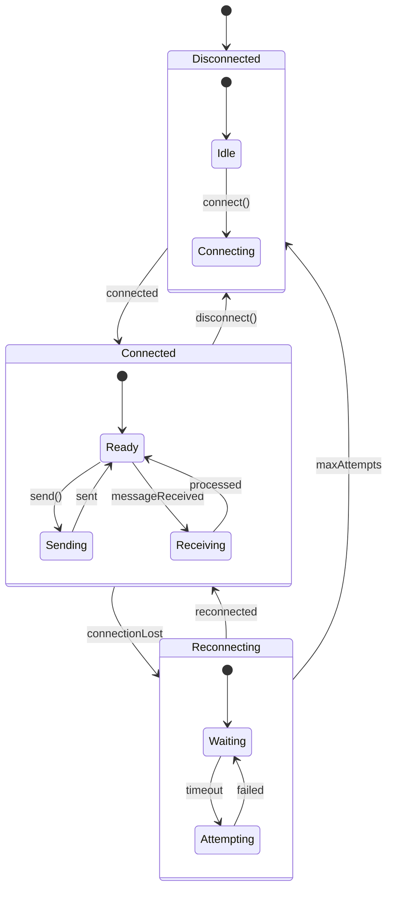

### Payment State Machine

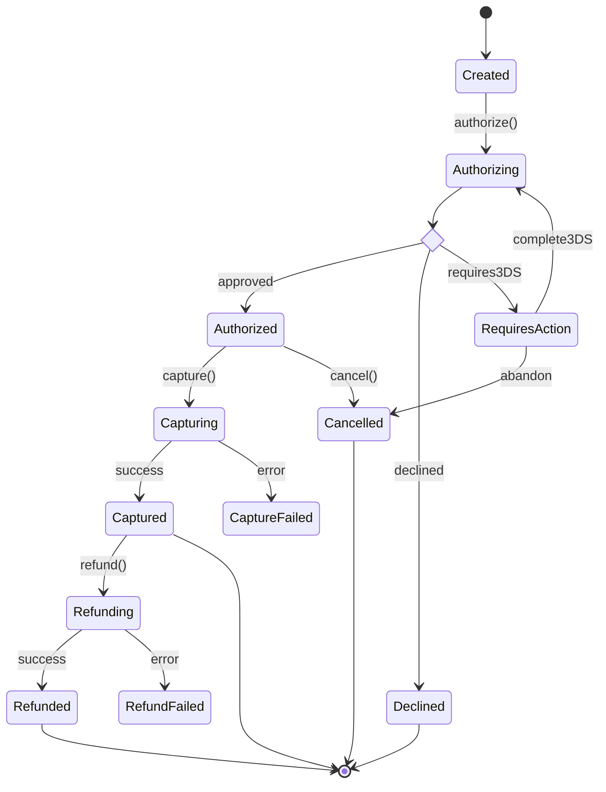
